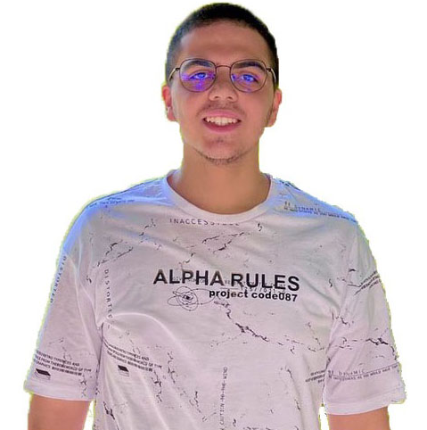

<!DOCTYPE html>
<html lang="en">

<head>
  <meta charset="UTF-8" />
  <title>Abdulrahim's CV</title>
  <link rel="stylesheet" href="Pro-CV.css" />
  <link rel="stylesheet"
    href="https://fonts.googleapis.com/css2?family=Material+Symbols+Outlined:opsz,wght,FILL,GRAD@48,400,0,0" />
  <link rel="stylesheet"
    href="https://fonts.googleapis.com/css2?family=Material+Symbols+Outlined:opsz,wght,FILL,GRAD@48,400,0,0" />
</head>

<body>

  <header>
    

      <h1>Abdulrahim Almokayed</h1>
      <h2>A juniour backend developer.</h2>
      <h3>I'm a student who have a passion to utilize my technical and management
        skills for achieving the target and
        developing the best performance. I would like to implement my
        innovative ideas, skills and creativity for
        accomplishing the projects.
        </h3>
    

    

      
        drafts
      
      Abdulrahimalmokayed@gmail.com
    

    

      
        smartphone
      
      +963940371006
    

  </header>
  <main>
    

      

        <h1>Work experience</h1>

        <ul>
          <li>
            <h2>Backend developer</h2>
          </li>
          <li>
            <h4>Internship at Raizer. october 2022</h4>
          </li>
          <li>-Team work </li>
          <li>-Develope websites projects for clients
          </li>
        </ul>
        <ul>
          <li>
            <h2>Mathematics - physics - chemistry teacher</h2>
          </li>
          <li>
            <h4>Private teacher for 12th grade students. December 2021</h4>
          </li>
          <li> -Monthly exams system </li>
          <li>-teaching to solve the problems by critical thinking </li>
        </ul>
        <ul>
          <li>
            <h2>Medical researcher</h2>
          </li>
          <li>
            <h4>translator at phyisio masters. october 2022</h4>
          </li>
          <li>- Searching for exciting and trusted medical researches</li>
          <li>- translating researches to arabic </li>
        </ul>
      

      

        <h1>Education</h1>

        <ul>
          <li>
            <h2>Medicine </h2>
          </li>
          <li>
            <h4>Class of 2027 in Aleppo University</h4>
          </li>
          <li> -93.57 in pre-year exams </li>
        </ul>
        <ul>
          <li>
            <h2>Math olympiad</h2>
          </li>
          <li>
            <h4>creativity agency</h4>
          </li>
          <li> -Unofficial honoruble mention in APMO 2020 </li>
          <li>-the 4th in the central test </li>
        </ul>
      

      

        <h1>Interests</h1>

        <Table>
          <tr>
            <td>- Technology</td>
            <td>- Music </td>
          </tr>
          <tr>
            <td>- Phsycology</td>
            <td>- Pysiology </td>
          </tr>
          <tr>
            <td>- Mathematics</td>
            <td>- Anime</td>
          </tr>
          <tr>
            <td>- Cooking </td>
            <td>- Reading</td>
          </tr>

        </Table>
      

    

    

      

        <h1>Skills</h1>

        <ul>
          <li>
            <h2>Technical skills </h2>
          </li>
          <li>
            <h4>Programing:</h4>
          </li>
          <li>- HTML</li>
          <li>- CSS </li>
          <li>- Java script</li>
          <li>- PHP </li>
          <li>- Python</li>
        </ul>
        <ul>
          <li>
            <h2>Soft skills</h2>
          </li>
          <li>- Emotional intelligence
          </li>
          <li>- Decision Making
          </li>
          <li>- Creativity
          </li>
          <li>- Quick learning
          </li>
          <li>- Adaptabilty
          </li>
        </ul>
      

      

        <h1>Languages</h1>
        <table>
          <tr>
            <td>
              <h4>Arabic</h4>
            </td>
            <td></td>
          </tr>
          <tr>
            <td>
              <h4>English</h4>
            </td>
            <td></td>
          </tr>
          <tr>
            <td>
              <h4>French</h4>
            </td>
            <td> </td>
          </tr>
          <tr>
            <td>
              <h4>Deutch</h4>
            </td>
            <td> </td>
          </tr>
        </table>
      

    

  </main>
</body>

</html>
